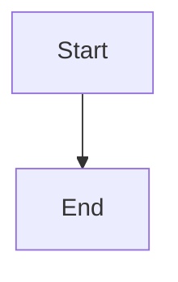

# mmdump
Dump tools for mermaid CLI
## Description
Extract mermaid block from md file to create mmd file and image file.
## Usage
```Go
import (
	"fmt"
	"os"

	"github.com/kotaoue/mmdump"
)

func main() {
	if err := mmdump.Dump("input.md", "output.svg"); err != nil {
		fmt.Fprintln(os.Stderr, err)
		os.Exit(1)
	}
}
```

### Example

Given the following `input.md`:

````markdown
# Example

Some text here.



More text here.
````

Running `mmdump.Dump("input.md", "output.svg")` will:

1. Extract the mermaid block and write it to `input.mmd`:


2. Run `mmdc --input input.mmd --output output.svg` to generate `output.svg`.

## Links
* [mermaidjs/mermaid.cli](https://github.com/mermaidjs/mermaid.cli)